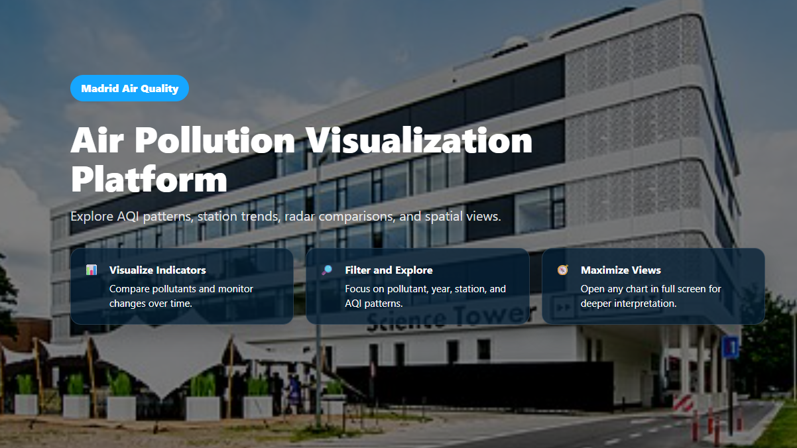
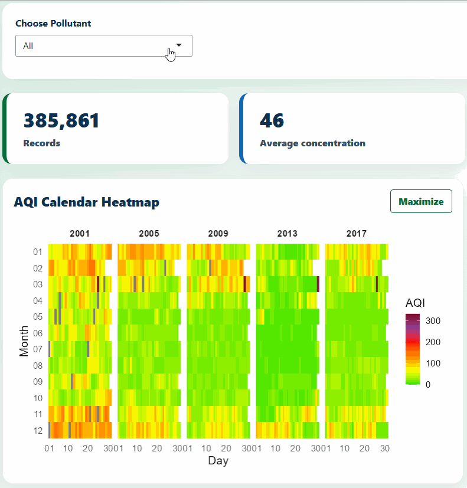
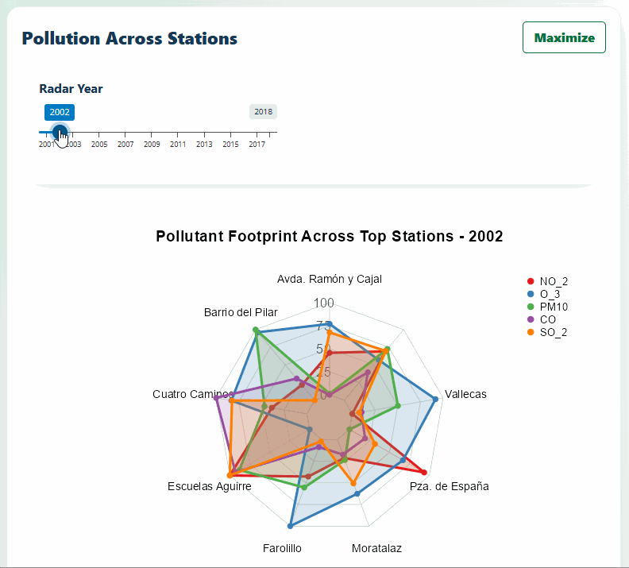
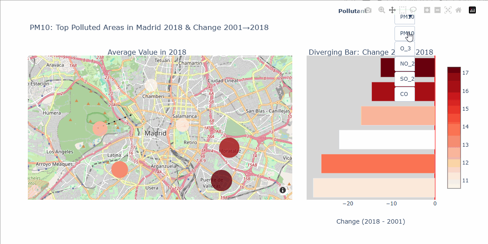

# Madrid Pollution Dashboard

This repository contains a Shiny dashboard for the Madrid air pollution visualisation project. It provides an interactive user interface to explore pollution levels in Madrid.



## Screencast

A Youtube Video demonstrating the dashboard can be found at https://www.youtube.com/watch?v=masXG2O_Q0U 

## Data

The dataset contains repeated measurements from 17 different pollutants across 24 different regions of Madrid between 2001 and 2018. The aim of the project is to analyse this dataset and present it to the population of Madrid, to inform inhabitants about the problem of air pollution in their city.

## Demo

<p align="center">
  
</p>

<p align="center">
  
</p>

<p align="center">
  
</p>

## Run

1. Open this folder in RStudio.
2. Install required R packages if prompted:

```r
install.packages(c("shiny", "DT", "tidyverse", "lubridate", "scales", "fmsb", "plotly", "htmltools", "bslib", "shinyjs", "reticulate"))
```

3. Run:

```r
shiny::runApp()
```

## Main files
- `ui.R` - dashboard layout, sidebar, tabs, and maximizer UI.
- `server.R` - output orchestration.
- `global.R` - packages, data loading, and sourcing plot scripts.
- `R/plots/` - separate plot code.
- `www/app.css` - visual styling.
